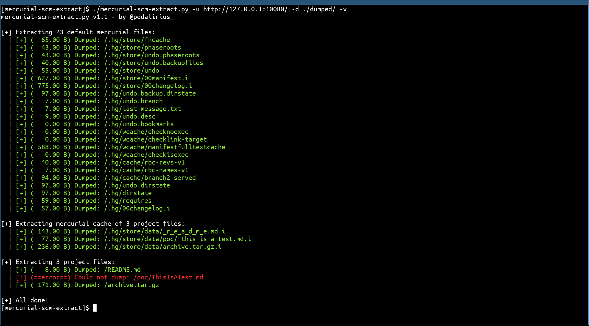

<p align="center">
    A tool to extract and dump files of mercurial SCM exposed on a web server.
    <br>
    
    <a href="https://twitter.com/intent/follow?screen_name=podalirius_" title="Follow"></a>
    <a href="https://www.youtube.com/c/Podalirius_?sub_confirmation=1" title="Subscribe"></a>
    <br>
</p>

## Features

 - [x] Extracts files of mercurial SCM exposed on a web server.
 - [x] Dump project files and .hg/ files locally.

## Usage

```
$ ./mercurial-scm-extract.py -h
mercurial-scm-extract.py v1.1 - by Remi GASCOU (Podalirius)

usage: mercurial-scm-extract.py [-h] -u URL -d DIR [-k] [-v]

options:
  -h, --help         show this help message and exit
  -u URL, --url URL  Target URL.
  -d DIR, --dir DIR  Directory where to save dumped files.
  -k, --insecure     Allow insecure server connections when using SSL (default: False)
  -v, --verbose      Verbose mode. (default: False)
```

## Example



## Contributing

Pull requests are welcome. Feel free to open an issue if you want to add other features.
